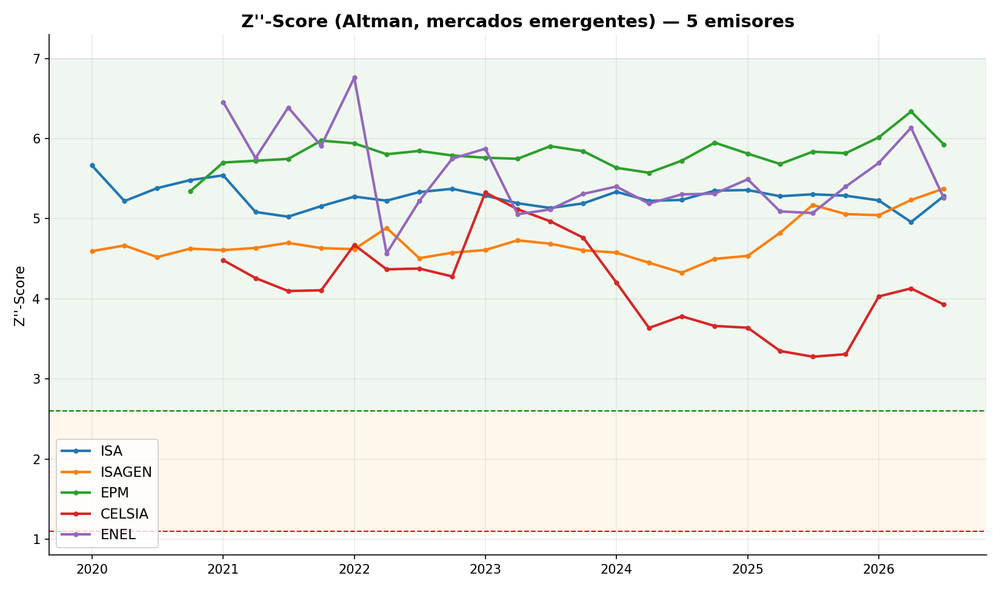
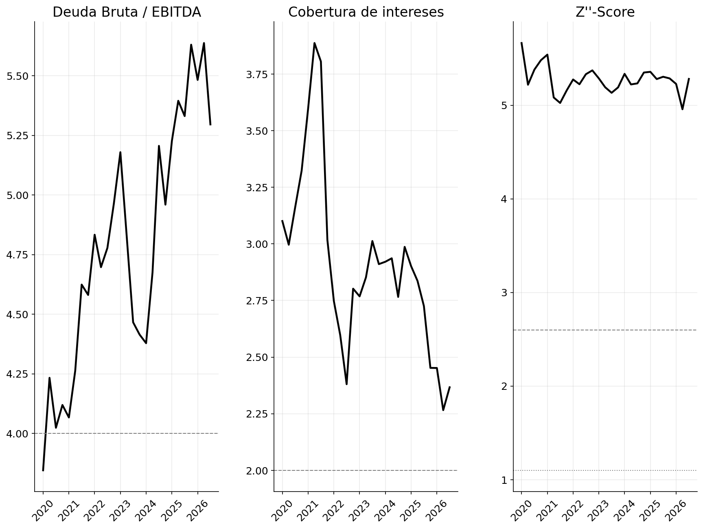
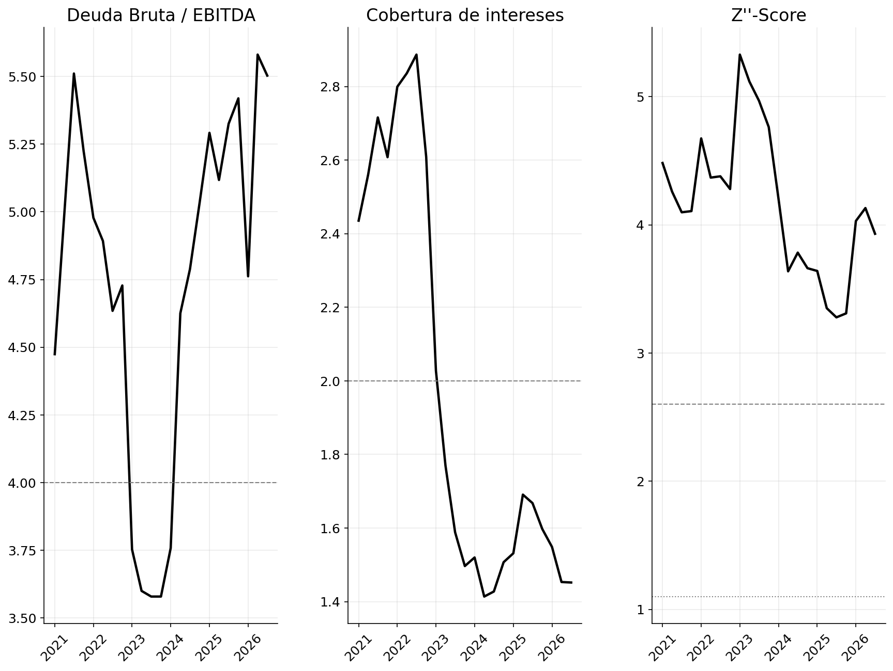
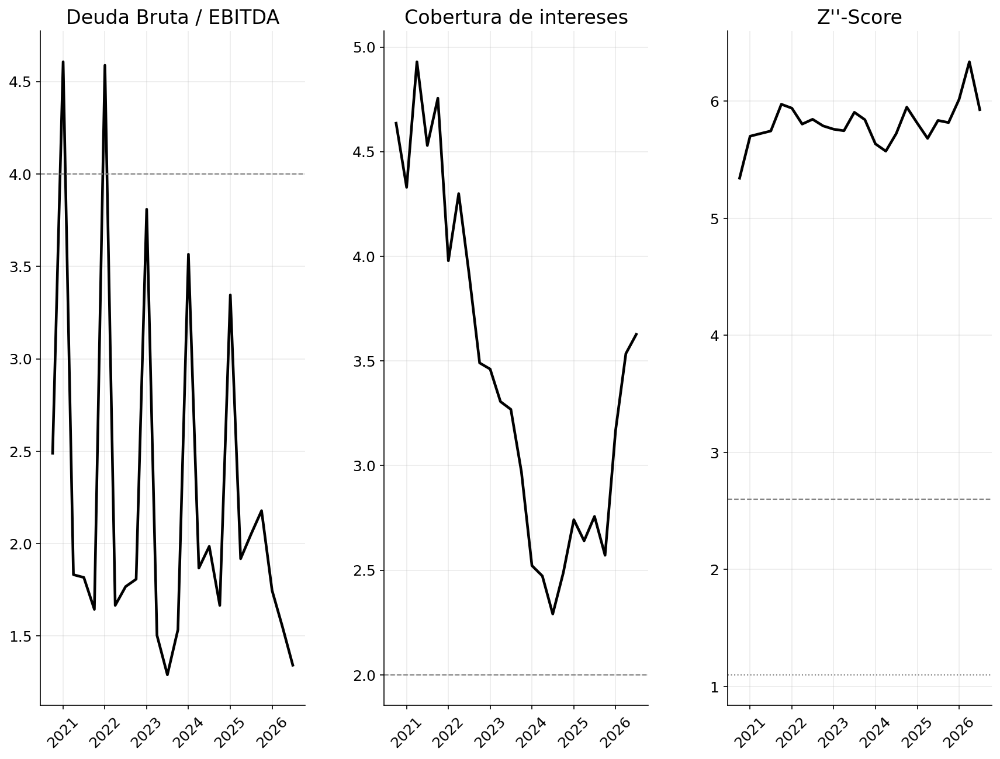
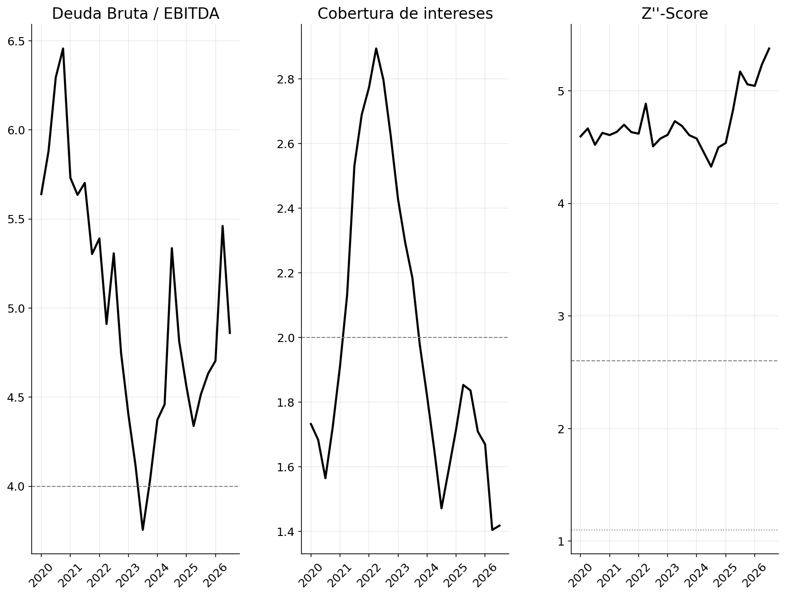
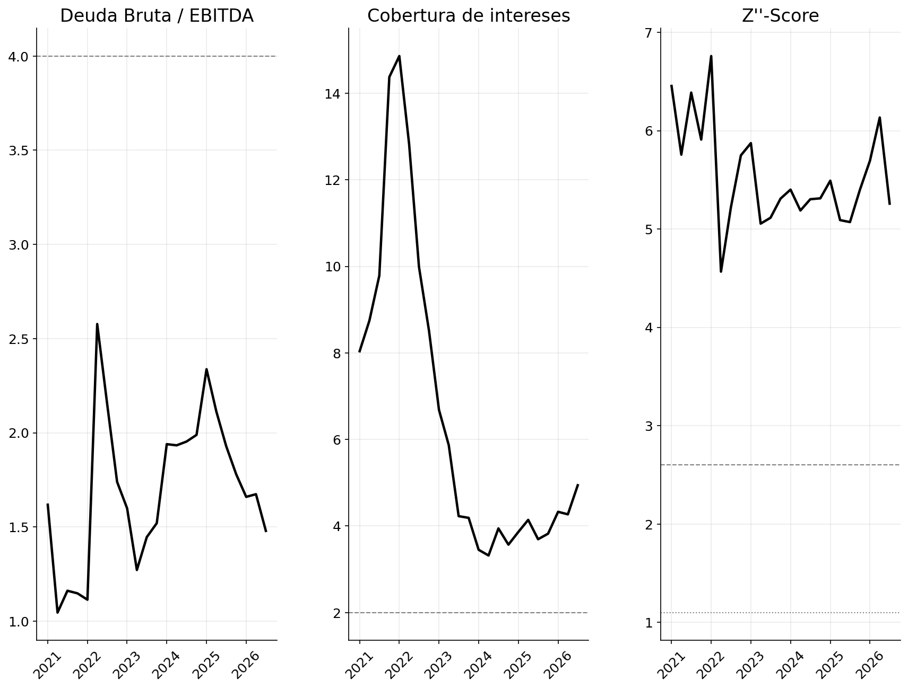
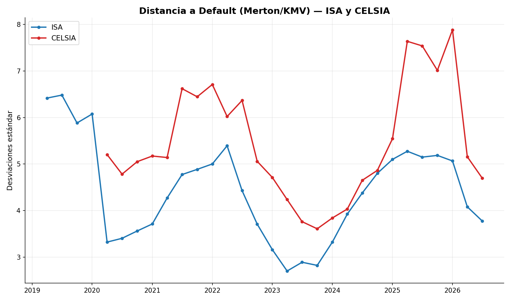

# Análisis de probabilidad de incumplimiento (emisores colombianos de energía)

Este proyecto analiza la probabilidad de incumplimiento de 5 emisores colombianos del sector
energético (ISA, ISAGEN, EPM, CELSIA y Enel Colombia), combinando un modelo contable (Z''-Score de
Altman) y un modelo de mercado (Distancia a Default de Merton/KMV).

## Qué hace este proyecto

1. Descarga y procesa los estados financieros trimestrales de los 5 emisores, publicados en formato
   **XBRL** por la Superintendencia Financiera de Colombia (RNVE), desde 2019-2020 hasta el trimestre
   más reciente disponible.
2. Calcula ratios de endeudamiento, cobertura, liquidez y rentabilidad sobre una ventana móvil de los
   últimos 12 meses (LTM).
3. Aplica el modelo Z''-Score de Altman (mercados emergentes) a los 5 emisores.
4. Aplica el modelo de Merton/KMV (Distancia a Default) a ISA y CELSIA, los únicos 2 con equity
   transado en la Bolsa de Valores de Colombia.

## Estructura del repositorio

```
├── data_xbrl/                    # 146 archivos XBRL descargados del RNVE
│   ├── ISA/<año>/<Q1|Q2|Q3|CIERRE> <año>.xbrl
│   ├── CELSIA/...                # (sin 2019, no disponible en el RNVE en XBRL)
│   ├── EPM/...
│   ├── ISAGEN/...                # Separado hasta cierre 2022; Consolidado desde cierre 2023
│   └── ENEL/...
├── data_precios/                 # Histórico de precios de la acción (ISA, CELSIA) para Merton
│   ├── isa_investing.csv
│   └── celsia_investing.csv
├── data_xbrl_out/                # Salidas del pipeline
│   ├── raw_quarterly_xbrl.csv    # Cifras crudas extraídas de los 146 archivos
│   └── ratios_xbrl.csv           # Ratios finales, LTM, Z''-Score
├── src/
│   ├── extract_xbrl.py           # Extracción de un archivo XBRL (Arelle + reconciliaciones)
│   ├── build_dataset_xbrl.py     # Recorre los 146 archivos y arma raw_quarterly_xbrl.csv
│   └── compute_ratios_xbrl.py    # Trimestre aislado, LTM, EBITDA reconstruido, ratios, Z''-Score
├── notebooks/
│   ├── 01_extraccion_datos.ipynb       # Documenta el proceso de extracción y sus hallazgos
│   └── 02_analisis_y_modelos.ipynb     # Gráficos, Z''-Score, Merton/KMV, conclusiones
├── img/                                 # Gráficas usadas en este README
└── Hallazgos_PD_Emisores_Energia.pdf   # Reporte de hallazgos por emisor (detalle ampliado)
```

## Cómo correrlo

```bash
pip install arelle-release pandas numpy scipy matplotlib --break-system-packages

# 1. Extraer los 146 archivos XBRL a raw_quarterly_xbrl.csv
python src/build_dataset_xbrl.py

# 2. Calcular ratios, LTM, EBITDA y Z''-Score
python src/compute_ratios_xbrl.py

# 3. Ver el análisis completo con gráficos y Merton/KMV
jupyter nbconvert --to notebook --execute notebooks/02_analisis_y_modelos.ipynb
```

## Metodología

### Extracción con XBRL

Cada archivo XBRL etiqueta cada cifra con su concepto exacto de la taxonomía IFRS (`ifrs:Assets`,
`ifrs:Revenue`, etc.) y su período exacto, lo que elimina la ambigüedad que suele haber al leer un
reporte financiero en un formato menos estructurado (a qué corresponde cada número según su posición,
qué unidad se usó, en qué orden vienen las columnas).

Los archivos se procesan con [Arelle](https://arelle.org/) (`arelle.Cntlr`), cargando cada XBRL con
`skipDTS=True` porque el entorno de desarrollo no tiene salida de red hacia los servidores donde vive
el esquema de la taxonomía (Superfinanciera, XBRL International); esto evita esa descarga sin afectar
la lectura de los datos del archivo en sí.

### Reconciliaciones aplicadas durante la extracción

Varias partidas se reportan bajo más de una etiqueta XBRL posible, y no siempre coinciden entre sí. En
vez de asumir cuál es la correcta, el extractor reconcilia contra un ancla conocida:

- **Deuda de largo/corto plazo:** algunas empresas (CELSIA) reportan "Obligaciones financieras" y
  "Bonos" en etiquetas separadas que hay que sumar; otras (ISA, ISAGEN) ya traen esa suma combinada en
  una sola etiqueta (sumarlos de nuevo ahí duplicaría la deuda). Se detecta cuál es el caso comparando
  ambas representaciones entre sí.
- **Pasivo corriente / no corriente:** se prefiere el hecho sin ninguna dimensión; solo se usa una
  versión con dimensión (por ejemplo, un desglose "total por subsidiaria" de una nota) cuando no
  existe ninguna versión sin dimensión, porque se comprobó que esas versiones con dimensión no siempre
  coinciden con el total real de esa partida.
- **Escala:** se toma del elemento XBRL `RoundingUsedInFinancialStatements`, que cada emisor declara
  explícitamente. ISAGEN es la excepción notable: declara "Pesos", sin ningún escalamiento.

### Validaciones aplicadas al dataset completo

- Activo = Pasivo + Patrimonio, verificado en las 146 filas (0 descuadres).
- Pasivo corriente + Pasivo no corriente = Pasivo total, verificado en las 143 filas con datos
  completos (0 descuadres).
- Monotonicidad de los acumulados dentro de cada año (un acumulado no debería bajar de un trimestre al
  siguiente); los pocos casos detectados en utilidad neta se investigaron uno por uno, confirmando que
  corresponden a volatilidad real de negocio, no a errores de extracción.
- Búsqueda de valores extremos en todos los ratios finales: 0 valores fuera de rango razonable en las
  146 filas.

### EBITDA

La taxonomía XBRL de la Superfinanciera no incluye una etiqueta de EBITDA como tal, así que se
reconstruye con el método indirecto para las 5 empresas por igual:

```
EBITDA = Utilidad neta + Impuesto de renta + Gastos financieros netos + Depreciación y amortización
```

### Z''-Score (Altman, mercados emergentes)

**Por qué se eligió:** es un modelo puramente contable (no depende de que la empresa cotice en
bolsa), así que se puede aplicar en las mismas condiciones a las 5 empresas del grupo. De los 5
emisores, solo ISA y CELSIA tienen acción transada; EPM, ISAGEN y Enel Colombia no. El Z''-Score es el
único de los dos modelos que permite comparar a las 5 empresas en igualdad de condiciones.

```
Z'' = 3.25 + 6.56·X1 + 3.26·X2 + 6.72·X3 + 1.05·X4
```

| Variable | Definición |
|---|---|
| X1 | (Activo corriente − Pasivo corriente) / Activo total |
| X2 | Ganancias retenidas / Activo total |
| X3 | EBIT / Activo total |
| X4 | Patrimonio / Pasivo total |

Zonas: Z'' > 2.6 (segura), 1.1-2.6 (gris), < 1.1 (riesgo). Son los umbrales originales del modelo de
Altman, calibrados para empresas manufactureras estadounidenses (no específicamente para utilities
colombianas), así que se leen como una señal relativa entre estos 5 emisores y en el tiempo, no como
una probabilidad de incumplimiento exacta.

### Merton / KMV (Distancia a Default)

**Por qué se eligió:** se usa como complemento del Z''-Score, no como reemplazo. El Z''-Score se
calcula con información contable que se publica cada trimestre, así que siempre va un paso atrás de
lo que efectivamente está pasando en la empresa. El mercado, en cambio, reacciona todos los días: si
los inversionistas perciben más riesgo en un emisor, eso se refleja de inmediato en el precio y la
volatilidad de su acción, antes de que aparezca en el siguiente reporte financiero. Por su naturaleza,
solo se puede aplicar a empresas con equity transado en bolsa (en este grupo, ISA y CELSIA), pero para
esas 2 ofrece una validación cruzada, en tiempo real, de lo que ya indica el modelo contable.

Trata el patrimonio como una opción call sobre el valor de los activos, y resuelve el sistema de
Black-Scholes-Merton para despejar el valor y la volatilidad (no observables directamente) de los
activos, a partir del valor y la volatilidad observados del equity en el mercado.

Supuestos documentados: acciones en circulación (ISA: 1.107.677.894; CELSIA: 1.069.972.554, ambas
cifras oficiales), tasa libre de riesgo del 13% (TES Colombia a 1 año, aproximada), precios diarios de
Investing.com desde enero de 2018.

## Resultados por empresa

Los 5 emisores se ubican en zona "segura" de Z''-Score en el trimestre más reciente disponible
(2T2026), sin ninguna señal que sugiera un incremento material en la probabilidad de incumplimiento en
el corto plazo.



### ISA

Tiene el apalancamiento más alto del grupo junto con CELSIA (5.30x Deuda Bruta/EBITDA), pero viene
acompañado del perfil de vencimientos más saludable de las 5 empresas: solo el 3.0% de su deuda total
vence en el corto plazo. La cobertura de intereses bajó de 2.86x a 2.38x en el último año, vale la
pena vigilarla, aunque el nivel actual sigue siendo razonable. Su Z''-Score es 5.28.

Con Merton, la Distancia a Default de ISA es de 3.8 desviaciones estándar (probabilidad de
incumplimiento implícita del mercado de aproximadamente 0.008% a un año), confirmando en tiempo real
la misma conclusión del modelo contable.



### CELSIA

Es el emisor que amerita mayor seguimiento del grupo. Combina el apalancamiento más alto (5.50x), la
cobertura de intereses más ajustada de las 5 (1.45x, por debajo del referente de 2.0x), una razón
corriente de 0.85x (el activo corriente no cubre el pasivo corriente) y la segunda mayor concentración
de deuda de corto plazo (19.6%). Ninguno de estos indicadores por separado está fuera de lo normal del
sector; lo que distingue a CELSIA es que los 4 apuntan en la misma dirección al mismo tiempo.

Aun así, su Z''-Score es 3.93 (zona segura), y mejoró frente al 3.48 del año anterior. Con Merton, la
Distancia a Default es de 4.7 desviaciones estándar (probabilidad de incumplimiento implícita de
apenas 0.0001%): a pesar de las señales de apalancamiento y liquidez de los ratios contables, el
mercado no le está poniendo precio a un riesgo de incumplimiento cercano.



### EPM

El balance más conservador del grupo: el apalancamiento más bajo (1.34x), con una mejora notable
frente al 2.25x del año anterior. Su cobertura de intereses subió de 2.66x a 3.63x, y el margen EBITDA
de 24% a 35%. Su Z''-Score, 5.93, es el segundo más alto del grupo (la trayectoria de fortalecimiento
más clara de las 5 empresas).



### ISAGEN

La empresa más rentable del grupo (margen EBITDA de 56%, esperable en un generador hidroeléctrico con
activos ya depreciados), pero con el balance patrimonial más apalancado (Pasivo/Activo de 79%, el más
alto del grupo). Su cobertura de intereses, 1.42x, es la más ajustada junto con CELSIA. Su Z''-Score,
5.38, mejoró frente al 4.76 del año anterior; la rentabilidad tan alta de la operación es lo que
sostiene ese balance más apalancado.



### Enel Colombia

Junto con EPM, el perfil de menor riesgo del grupo: la cobertura de intereses más alta de las 5
(4.94x, en clara mejora), apalancamiento bajo (1.48x, frente a 2.09x el año anterior) y margen EBITDA
en mejora (28% a 39%). Su razón corriente, 0.66x, es la más baja del grupo, pero no viene acompañada
de otras señales de alerta. Su Z''-Score, 5.26, confirma un perfil sólido.



### Merton (ISA y CELSIA)



## Comparativo final

| Empresa | Deuda/EBITDA | Cobertura int. | Razón corriente | Margen EBITDA | Z''-Score |
|---|---|---|---|---|---|
| ISA | 5.30x | 2.37x | 2.69x | 37.6% | 5.28 |
| ISAGEN | 4.86x | 1.42x | 2.71x | 56.2% | 5.38 |
| EPM | 1.34x | 3.63x | 1.20x | 35.1% | 5.93 |
| CELSIA | 5.50x | 1.45x | 0.85x | 16.1% | 3.93 |
| ENEL | 1.48x | 4.94x | 0.66x | 39.1% | 5.26 |

## Limitaciones

Algunas notas metodológicas breves: en 4 de 146 trimestres (ENEL 3T2019; EPM 2T2019, 3T2019 y 1T2020),
el archivo del RNVE contiene un período distinto al que indica su nombre (confirmado con un hash
idéntico entre la descarga original y una redescarga), así que quedan sin datos. Para ISA, el ingreso
usado es el total reportado (la desagregación "sin construcción" que ISA presenta en su reporte
ejecutivo no existe en el XBRL). Para CELSIA, el EBITDA reconstruido no incluye el ajuste por "método
de participación" que la empresa sí suma en su EBITDA reportado públicamente. Para ISAGEN, los años
2019-2022 usan estados Separados en vez de Consolidados (única fuente disponible en XBRL para esos
años), aunque se validó que la diferencia entre ambos es menor al 1% para esta empresa en particular.
Los umbrales de referencia usados (Deuda/EBITDA, cobertura, Z''-Score) son orientativos, no un límite
normativo ni calibrado específicamente para el mercado colombiano.

Para más detalle por emisor, ver `Hallazgos_PD_Emisores_Energia.pdf`.

## Créditos

La extracción con Arelle sigue la metodología del ejercicio de referencia de
[Andrés Gómez Hernández](https://co.linkedin.com/in/andres-gomez-hernandez) (cargar el XBRL con
`Cntlr`, convertir sus *facts* en una tabla y filtrar por concepto y fecha), extendida para manejar
desgloses por dimensión, múltiples empresas y las reconciliaciones descritas arriba.
